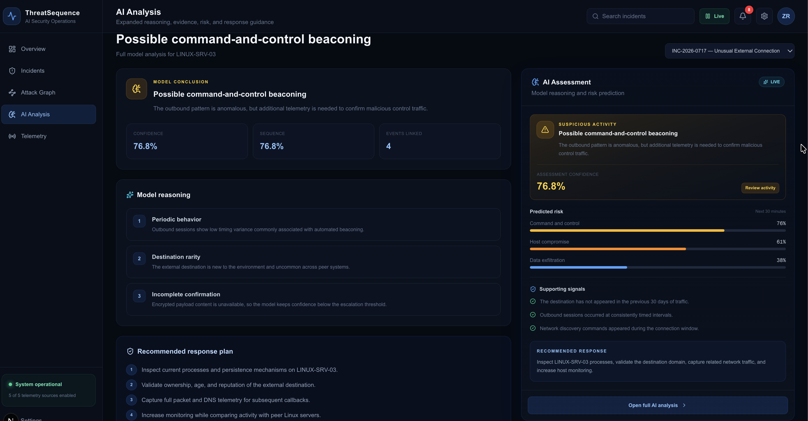
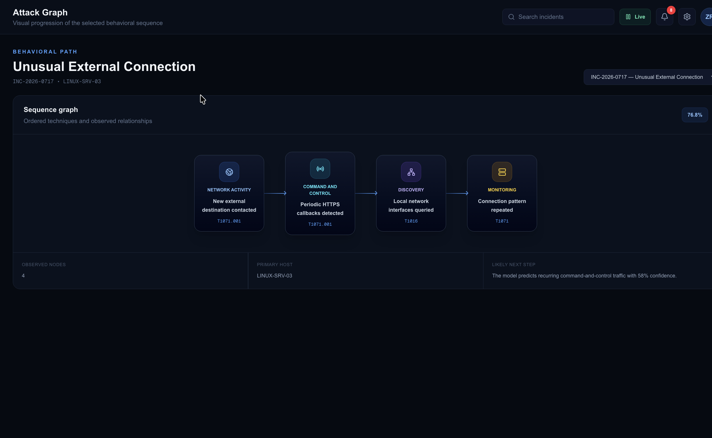
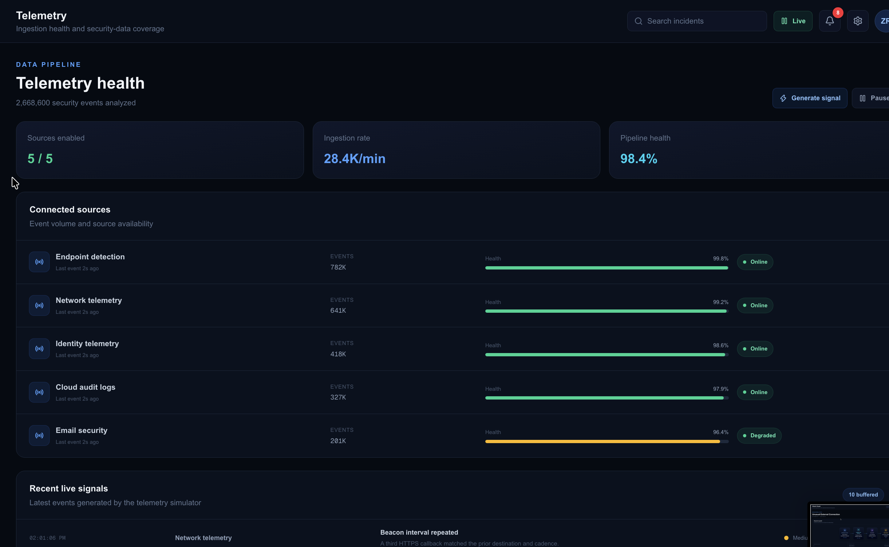
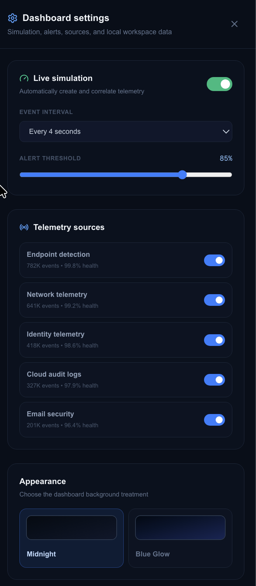
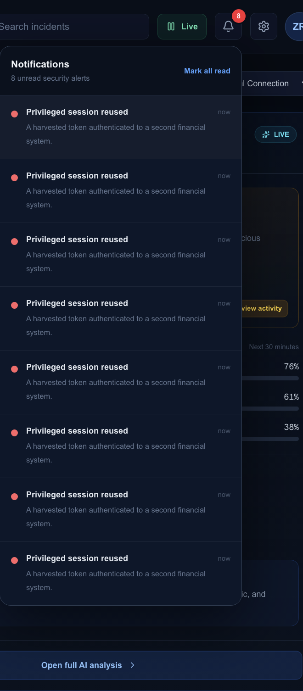

ThreatSequence

An interactive security operations prototype for reconstructing attack behavior, assessing risk, and managing incidents from detection through resolution.

Built with Next.js, TypeScript, Tailwind CSS, and Lucide React.

ThreatSequence is a portfolio prototype. Its incidents, telemetry, predictions, and AI assessments are simulated and do not represent a production detection system.

  

Why ThreatSequence

Security analysts rarely investigate a single alert in isolation. They piece together activity across endpoints, networks, identities, cloud services, and email systems to understand what happened and what may happen next.

ThreatSequence explores that workflow through a polished SOC interface. Instead of presenting disconnected alerts, it organizes related events into a behavioral sequence and gives the analyst the context needed to investigate and respond.

The project demonstrates:

Security-event correlation and MITRE ATT&CK mapping

Behavioral attack timelines and likely next-step prediction

Explainable risk assessments with supporting evidence

Analyst ownership, notes, and incident-status workflows

Live telemetry simulation and source-health monitoring

Persistent, configurable browser-based workspace state

Core Experience

Capability

What it does

Mission Control

Summarizes environment health, active incidents, live metrics, attack timelines, and the selected incident's assessment.

Incident Workspace

Supports search, filtering, analyst assignment, investigation notes, severity changes, and response-state tracking.

Attack Graph

Presents correlated activity as an ordered path with security stages, event relationships, confidence, and MITRE ATT&CK techniques.

AI Analysis

Explains the simulated model conclusion through risk estimates, supporting signals, confidence, and recommended actions.

Telemetry

Simulates endpoint, network, identity, cloud, and email events while displaying volume, ingestion rate, and source health.

Workspace Controls

Provides simulation settings, notification tracking, browser persistence, JSON export, themes, and a protected reset.

Interface

Behavioral Attack Graph

The graph turns related events into a readable attack path. Each node identifies the observed behavior, attack stage, data source, and associated MITRE ATT&CK technique.

  

Telemetry Health

The telemetry workspace shows connected security sources, pipeline health, event volume, and ingestion activity. The stream can be paused, resumed, accelerated, or advanced manually.

  

Settings and Notifications

Simulation speed, alert thresholds, telemetry sources, and appearance can be configured from the settings panel. The notification center tracks unread alerts and links analysts directly to related incidents.

<table>
  <tr>
    <td align="center" width="50%"><strong>Workspace Settings</strong></td>
    <td align="center" width="50%"><strong>Security Notifications</strong></td>
  </tr>
  <tr>
    <td valign="top">
      
    </td>
    <td valign="top">
      
    </td>
  </tr>
</table>

How It Works

flowchart LR
A["Simulated telemetry"] --> B["Event correlation"]
B --> C["Attack sequence"]
C --> D["Risk assessment"]
D --> E["Analyst response"]

Client-side generators produce fictional endpoint, network, identity, cloud, and email events.

Related activity is grouped into an incident and ordered into a behavioral sequence.

Predefined analysis logic provides confidence, predicted risk, supporting signals, and response guidance.

The analyst can assign ownership, add notes, change status, contain activity, and resolve the incident.

The workspace is stored in the browser so investigation state remains after a refresh.

Technology

Layer

Technology

Application

Next.js and React

Language

TypeScript

Interface

Tailwind CSS

Icons

Lucide React

Persistence

Browser localStorage

Deployment

Vercel-ready

Run Locally

Requirements

Node.js 20 or newer

npm

Setup

git clone https://github.com/Zachary200114/ThreatSequence.git
cd threatsequence
npm install
npm run dev

Open http://localhost:3000.

Production Build

npm run build
npm start

Explore the Demo

For a quick walkthrough:

Select incidents of different severities and compare their timelines and assessments.

Search by incident ID, host, title, severity, or MITRE ATT&CK technique.

Review the Attack Graph and full AI Analysis for the selected incident.

Generate a telemetry signal, then pause or change the speed of the live simulation.

Assign an analyst, add an investigation note, and move the incident through the response workflow.

Refresh to verify persistence, then export the workspace as JSON.

Scope and Limitations

All incidents, hosts, alerts, and telemetry are fictional.

AI conclusions are simulated with predefined scenarios and client-side logic.

No SIEM, EDR, identity provider, cloud platform, or threat-intelligence feed is connected.

Workspace data is stored locally in each visitor's browser.

The prototype has no authentication, shared database, or multi-user collaboration.

It should not be used for production monitoring or automated security decisions.

These boundaries make the project safe and easy to explore while keeping its claims accurate.

<strong>Project structure</strong>

.
├── assets/
│ ├── ai-analysis.png
│ ├── attack-graph.png
│ ├── dashboard-settings.png
│ ├── noti.png
│ └── telem.png
├── public/
├── src/
│ └── app/
│ ├── favicon.ico
│ ├── globals.css
│ ├── layout.tsx
│ └── page.tsx
├── .gitignore
├── eslint.config.mjs
├── next.config.ts
├── package.json
├── package-lock.json
├── postcss.config.mjs
├── README.md
└── tsconfig.json

<strong>Potential next steps</strong>

Backend API and database persistence

Authentication and role-based access control

Real-time multi-user case collaboration

Sanitized public security-dataset ingestion

Auditable live-model outputs and analyst feedback

Accessibility checks and automated testing

Author

Zachary Ryan

Cybersecurity researcher, U.S. Navy veteran, and B.S. Cybersecurity student interested in security operations, AI security, and cybersecurity governance.
